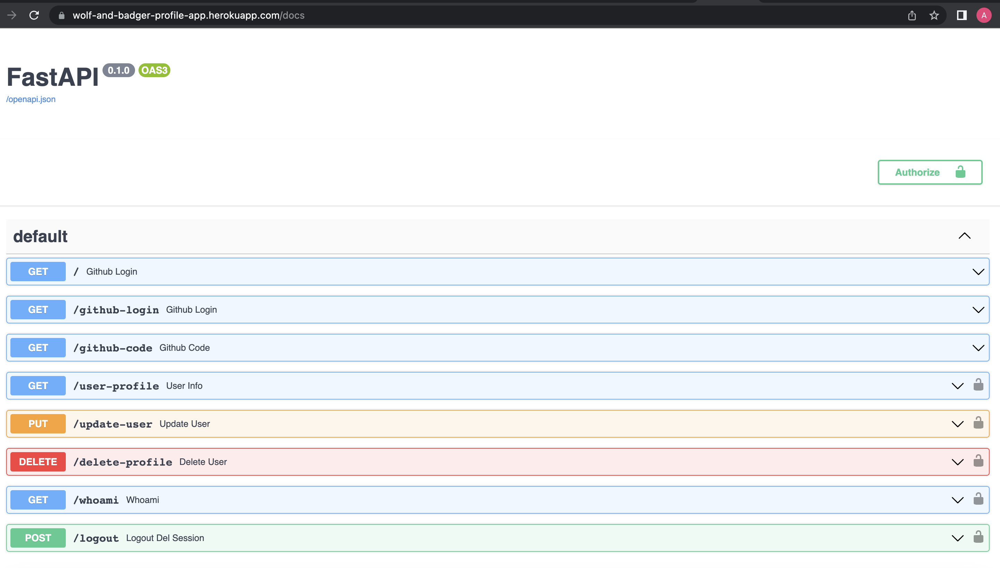

# Github_Oauth_Profile_WB
This repository contains an application that allows user authentication using the GitHub OAuth provider. Once authenticated, users can perform CRUD operations on a database of users. This application was built as a test \


#### ...IMPORTANT: 
- First Log In in the browser /github-login to create a session then go to: /docs




## Setup - easy way to run it 
- Create a virtual environment in the root of the project by running the following command:
  - ``` python -m venv venv  ```
- Activate the virtual environment:
  - ``` source venv/bin/activate ```
- Install the required packages listed in the requirements.txt file by running:
  - ``` pip install -r requirements.txt ```
- Run the application using Uvicorn by running the following command:
  - ``` uvicorn app.index:app --host 0.0.0.0 --port 15400 --reload ```

### To run with docker compose.  be sure you have docker installed:
  - be sure you are in the main branch
    - ``` docker-compose up -d ```

### You will be also to see the app deployed at:

  - https://wolf-and-badger-profile-app.herokuapp.com/


## endpoints 

If you are local:
- http://0.0.0.0:15400  

the deployed URL 
- https://wolf-and-badger-profile-app.herokuapp.com/

Note: If a user is not logged In, you will not be able to execute the endpoints, you will get session invalid instead

 #### /
    ✔️This is the home page, it shows a message with a link to the /github-login endpoint.

 #### /github-login
    ✔ This endpoint redirects the user to the GitHub OAuth authorization page. The user will be prompted to log in to their GitHub account and authorize the application to access their profile information.
  * Method: GET
  * Description: Redirects the user to the GitHub OAuth authorization page.

 #### /github-code?code=<code>
    ✔ ️This endpoint receives the code from the /github-login endpoint and creates a new user session. It also creates a new user in the database with the information from the user's GitHub profile.
  * Method: GET
  * Description: Receive code from the GitHub logging and init the session.
  * Parameters: code: The code returned by GitHub after the user has logged in and authorized the application to access their profile information.

 #### /user-profile
    ✔ ️This endpoint returns the information for the logged-in user, including their profile information.
  * Method: GET
  * Description: Retrieve the profile information of the logged-in user.
  * Note: This endpoint requires a valid session.

 #### /update-user
    ✔ ️This endpoint receives parameters to update the pre-defined fields for the logged-in user.
  * Method: PUT
  * Description: Update the pre-defined fields for the logged-in user.
  * Parameters: 
     - name: The new name of the user
     - company: The new company of the user
     - blog: The new blog of the user
     - location: The new location of the user 
     - bio: The new bio of the user 
     - past_address: The new past_address of the user 
     - actual_address: The new actual_address of the user 
     - phone_number: The new phone_number of the user 
     - age: The new age of the user 
     - gender: The new gender of the user 
     - birthday: The new birthday of the user 
     - email: The new email of the user 
     - Note: This endpoint requires a valid session.
  * Note: This endpoint requires a valid session.

 ####  /delete-profile
    ✔ ️This endpoint allows the logged-in user to delete their user profile.
  * Method: DELETE
  * Description: Delete the user profile of the logged-in user.
  * Note: This endpoint requires a valid session.

 #### /whoami
    ✔ ️This endpoint returns the information for the logged-in user, including their profile information.
  * Method: GET
  * Description: Retrieve the information of the logged-in user.
  * Note: This endpoint requires a valid session.

 #### /logout
    ✔ ️This endpoint allows the logged-in user to log out.
  * Method: GET
  * Description: Log out the current user and delete the session.
  * Note: This endpoint requires a valid session.
